# Infrastructure as Code with AWS CDK

**Stack:** API Gateway → Lambda, defined entirely in TypeScript and deployed via the CDK CLI

This run covers the base Lambda + API Gateway stack end-to-end: write the code, bootstrap the account, synthesize, deploy, verify it actually works, poke around in CloudFormation, then tear it down. The `HitCounter`/DynamoDB construct from the full guide is a separate next pass, not part of this particular run.

---

## ⚠️ Security note on this run

The first `cdk bootstrap` attempt failed with a credentials error, which got resolved by setting `$env:AWS_ACCESS_KEY_ID` and `$env:AWS_SECRET_ACCESS_KEY` directly in the terminal session. Those two screenshots are **deliberately left out** of this build log — they had a real, plaintext AWS access key and secret key visible in the terminal output, and including credential-bearing screenshots in something meant to document or share a project is exactly how AWS keys end up leaked.

**Follow-up:** that specific access key should be deactivated and deleted in IAM, and replaced with one configured via `aws configure` instead, so credentials live in `~/.aws/credentials` rather than in a terminal session that gets logged to shell history.

---

## Step 1: Bootstrap the account

`cdk bootstrap aws://Account-ID/us-east-2` — after credentials were configured, this stood up the `CDKToolkit` stack (IAM roles, an S3 staging bucket, an ECR repo for container assets). No screenshot here for the reason above, but it completed successfully before moving on.

---

## Step 2: Preview the CloudFormation template

`cdk synth` rendered the TypeScript stack into an actual CloudFormation template — IAM role, Lambda function resource, log group — before anything touched the account.

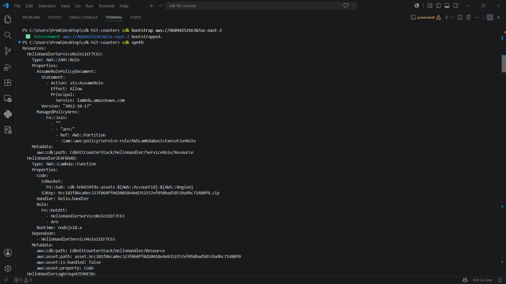
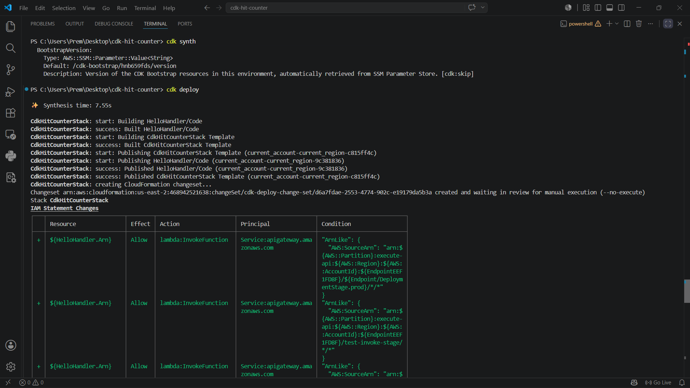

---

## Step 3: The Lambda handler

`lambda/hello.js` — a small handler returning a plain-text response.

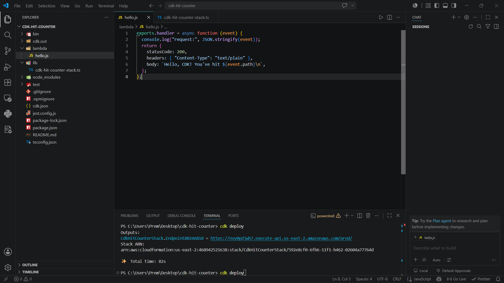

---

## Step 4: The stack definition

`lib/cdk-hit-counter-stack.ts` — the Lambda function and the API Gateway REST API in front of it, both declared in code.

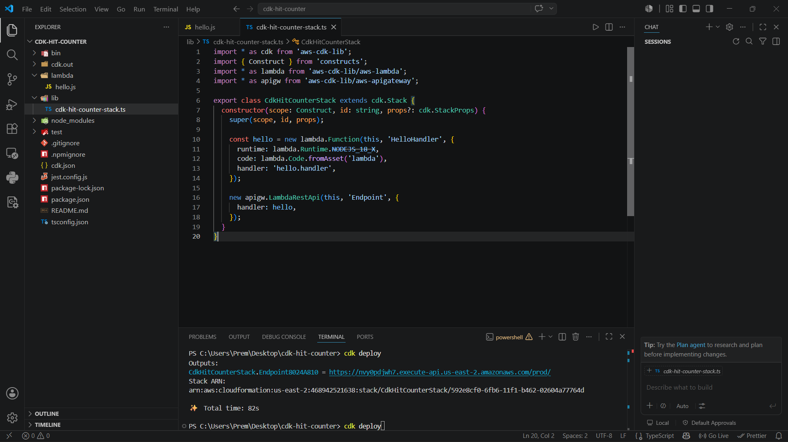

---

## Step 5: Deploy

`cdk deploy` surfaced the IAM permission changes it was about to make — API Gateway's permission to invoke the Lambda, the Lambda's basic execution role — before asking for confirmation.

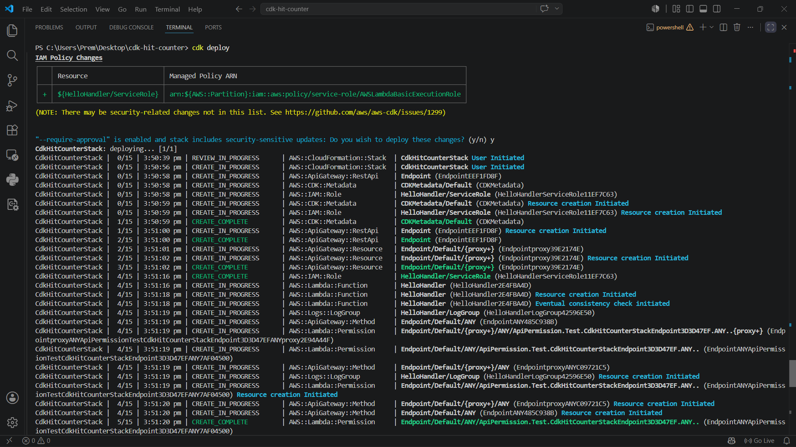

Confirmed, and CloudFormation worked through creating the RestApi, IAM role, Lambda function, and the API Gateway methods/permissions in dependency order.

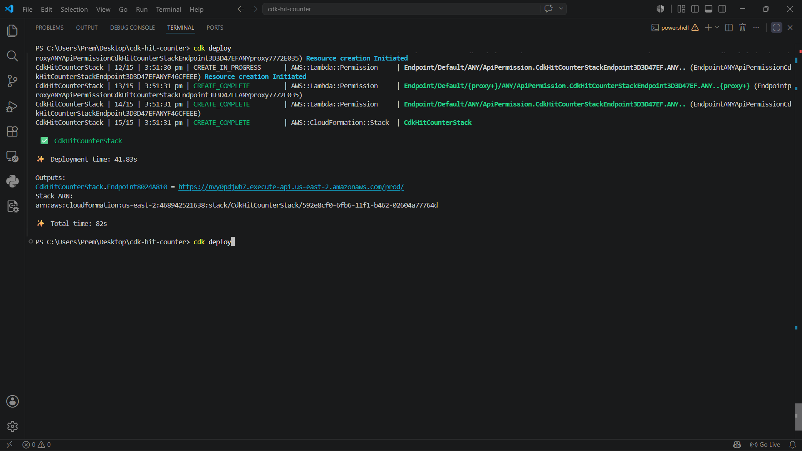

Deployment finished in 41.83s (82s total including synthesis/publishing), with the endpoint URL printed as output.

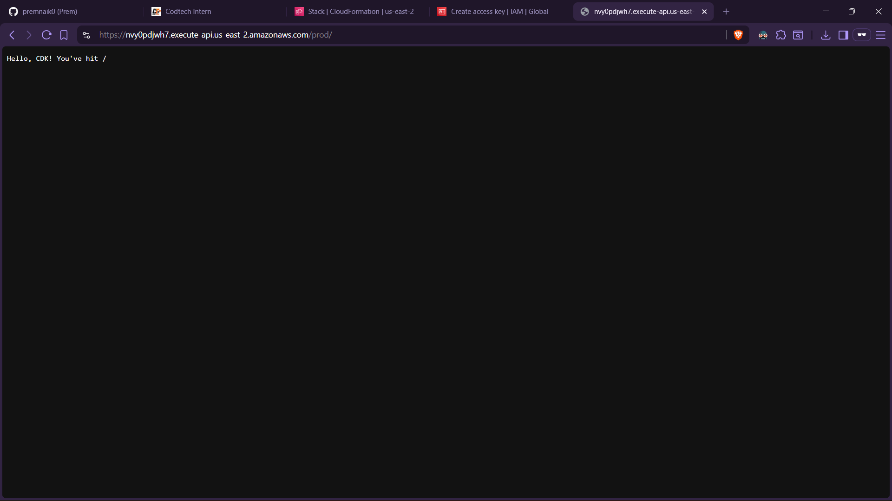

---

## Step 6: Test the live endpoint

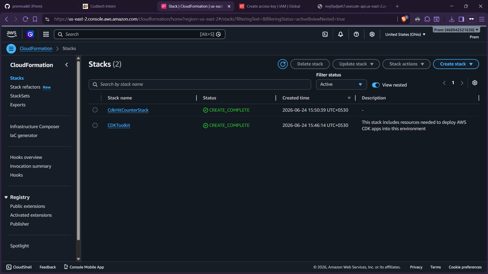

---

## Step 7: Inspect what CDK actually built, in CloudFormation

Two stacks exist after this deploy — the app itself, and the one-time bootstrap stack:

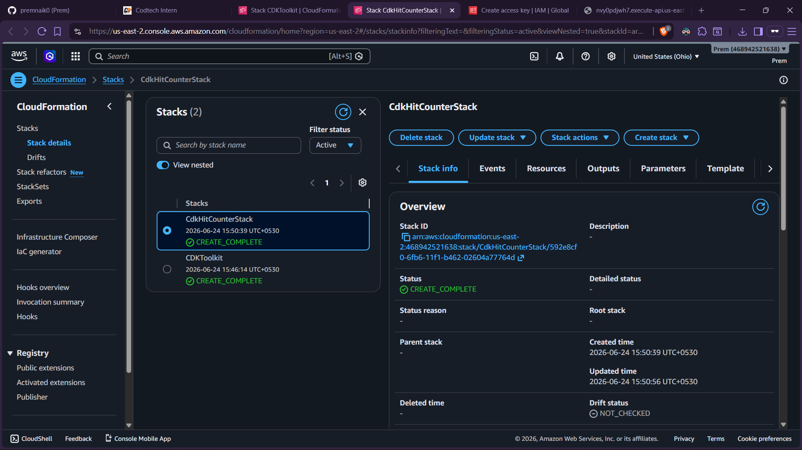

**`CdkHitCounterStack`** — the actual app (14 resources once IAM permissions, log groups, and API Gateway internals are counted):

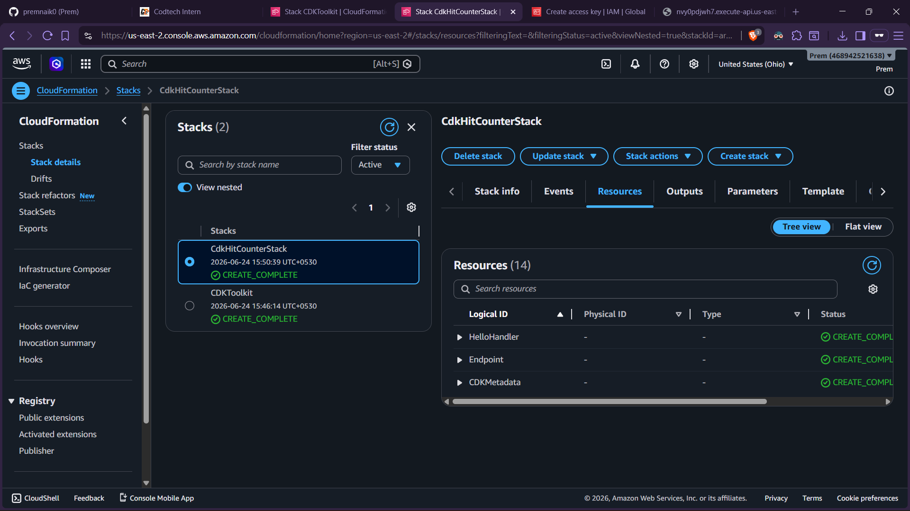
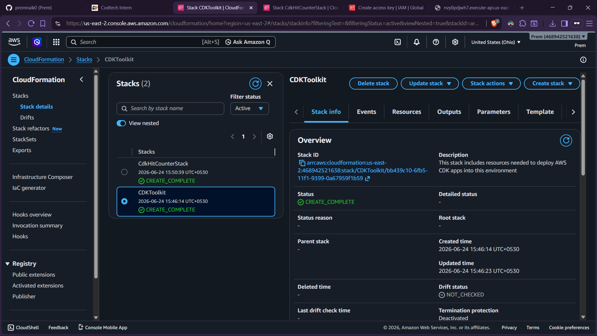

**`CDKToolkit`** — the bootstrap stack every CDK app in this account/region shares:

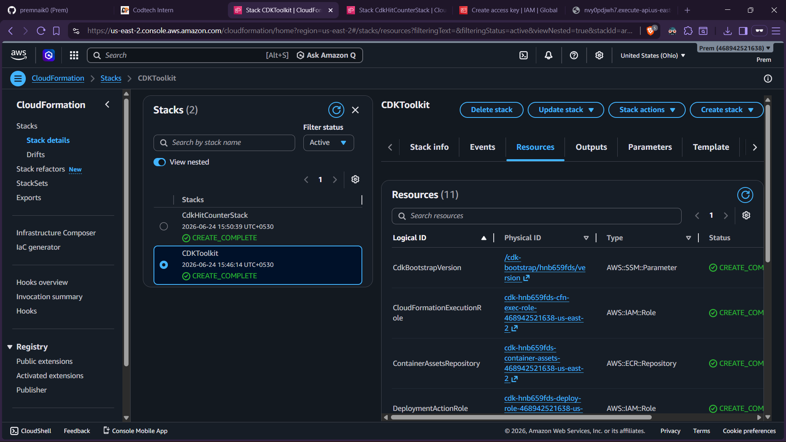
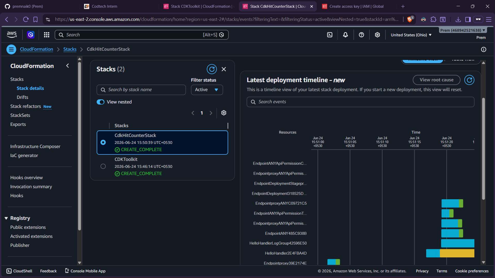

Also explored CloudFormation's newer **deployment timeline** view (Events tab) — a Gantt-style breakdown of exactly how long each individual resource took during the deploy.

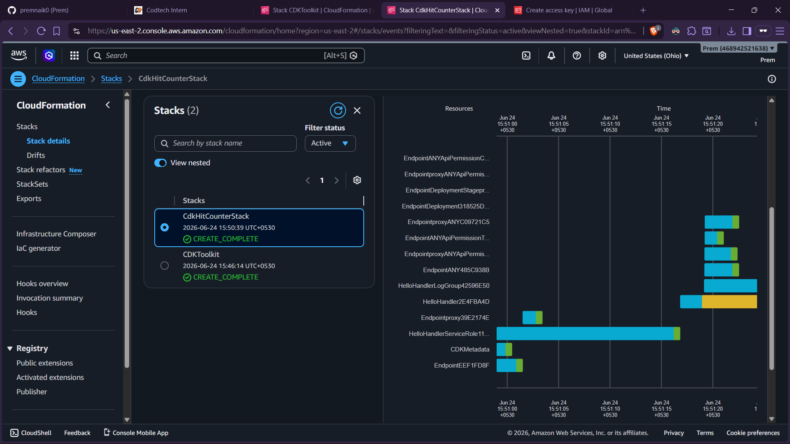
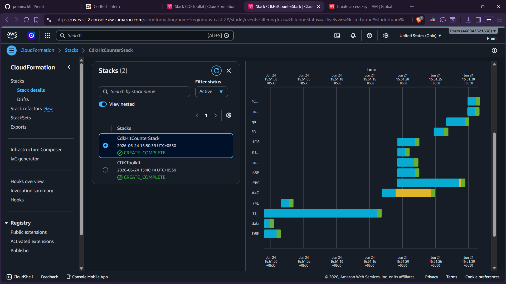

---

## Step 8: Tear it down

`cdk destroy`, confirmed with `y`. CloudFormation removed everything it had created — Lambda permissions, the API Gateway stage/deployment/methods, the Lambda function, the RestApi itself — automatically, in the correct dependency order.

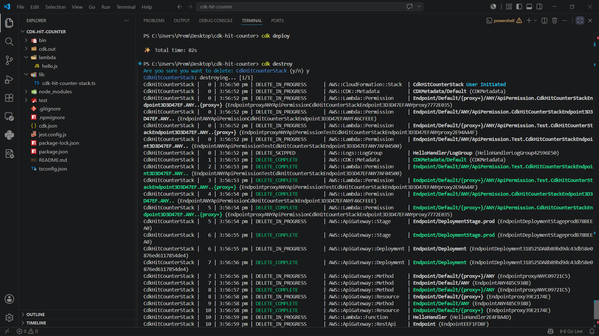

This is the part console-clicking doesn't give you for free: cleanup is exactly as repeatable as setup was.

---

## Notes / what this run taught

- **Credentials belong in `aws configure`, not `$env:` lines typed into a terminal.** Typed-in plaintext credentials persist in shell history and show up in any screenshot of that session.
- **`cdk synth` before `cdk deploy` earns its place** — it's the one point where you see the exact CloudFormation template before anything touches the account.
- **The IAM Statement Changes table during `cdk deploy` is worth actually reading**, not just clicking past — it showed API Gateway being granted permission to invoke the Lambda, visible proof of least-privilege access before confirming.
- **`CDKToolkit` is separate from the app stack** and stays behind even after `cdk destroy` removes the actual app — expected behavior, not a missed cleanup step.
- **CloudFormation's deployment timeline view** is a genuinely useful way to see where deploy time actually goes, resource by resource.
